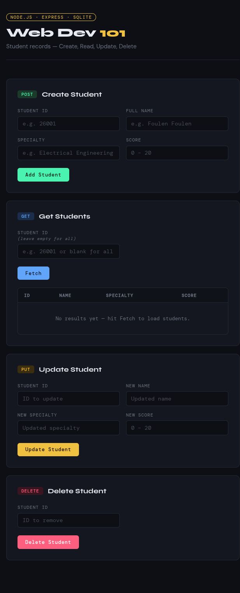

# Web Development 101

> [!NOTE]
>
> A beginner-friendly introduction to web development — from writing your first webpage to building a backend `API` with a real database.



This repository is designed to help students understand how the web actually works, by building things hands-on. We cover the frontend (what users see), the backend (the server behind the scenes), and the database (where data is stored and retrieved).

---
> [!IMPORTANT]
> By working through this project, you will understand:
>
> - How `HTML`, `CSS`, and `JavaScript` work together to build a webpage
> - What a web server is and how it handles requests
> - How to define `API` routes using `Express`
> - How to store and retrieve data using `SQLite`
> - The difference between frontend and backend
> - What `HTTP` methods (`GET`, `POST`, `PUT`, `DELETE`) mean and when to use them
---

## 🧱 The Building Blocks of the Web

Every website you visit is made of three core technologies working together:

### 🔷 HTML — The Structure
**HyperText Markup Language** is the skeleton of a webpage. It defines *what* is on the page: headings, paragraphs, buttons, forms, images, and so on. Without `HTML`, there is no content to display.

Think of it like the walls and rooms of a house — it gives everything a place to be.

```html
<h1>Hello, World!</h1>
<p>This is a paragraph.</p>
<button>Click me</button>
```

### 🎨 CSS — The Style
**Cascading Style Sheets** control how the HTML looks: colors, fonts, sizes, spacing, and layout. Without `CSS`, every webpage would look like a plain text document.

Think of it like the paint, furniture, and decoration of that house.

```css
h1 {
  color: steelblue;
  font-size: 2rem;
}
```

### ⚙️ JavaScript — The Behavior
**JavaScript** makes pages interactive and dynamic. It runs in the browser and can respond to user actions (like clicking a button), update the page without reloading it, and communicate with a server to send or receive data.

Think of it like the electricity — it makes things actually *do* something.

```js
document.querySelector('button').addEventListener('click', () => {
  alert('Button clicked!');
});
```

---

## 🖥️ Backend Tools

Once we go beyond static pages, we need a server. Here's what we use:

### 🟢 Node.js
**Node.js** lets you run `JavaScript` on the *server* side, not just in the browser. This means you can use one language (`JavaScript`) for both the frontend and the backend. `Node.js` is what powers our server.

### 🚂 Express
**Express** is a lightweight framework built on top of `Node.js`. It makes it easy to define *routes* — rules that tell the server what to do when it receives a request. For example: "When someone visits `/students`, send back a list of all students."

Without `Express`, you'd have to write a lot more low-level code to handle requests. `Express` keeps things simple and readable.

### 🗄️ SQLite3
**SQLite** is a simple, file-based database. Unlike big database systems that require a separate server, `SQLite` stores everything in a single file (`mydb.sqlite`) right in your project. It's perfect for learning and small projects.

We use the **better-sqlite3** `Node.js` package to interact with it from our server code — to store, retrieve, update, and delete data.

### 🔄 Nodemon
**Nodemon** is a development tool that automatically restarts your `Node.js` server every time you save a change to your code. Without it, you'd have to manually stop and restart the server after every edit — which gets tedious fast.

It's only used during development. Think of it as a "live reload" for your backend.

To start the server in development mode with nodemon:
```bash
npm run dev
```

---

## 📡 API Endpoints — `/students`

This project exposes a simple REST API for managing a list of students. All routes are under the `/students` URI.

| Method | Endpoint | Description |
|--------|----------|-------------|
| `POST` | `/students` | Add a new student to the database |
| `GET` | `/students` | Retrieve all students from the database |
| `GET` | `/students/:id` | Retrieve a student by their ID from the database |
| `PUT` | `/students/:id` | Update an existing student's data in the database |
| `DELETE` | `/students/:id` | Remove a student by their ID from the database |

These three methods map to the core operations of any data-driven application `CRUD`: **create**, **read**, **update**, and **delete**.

> [!TIP]
>
> You can test these endpoints using a tool like [Postman](https://www.postman.com/), [Apidog](https://apidog.com/), [curl](https://curl.se/) or directly from the browser's frontend interface.

---

## 🚀 Setup

### Prerequisites
Make sure you have [Node.js](https://nodejs.org/) installed on your machine.

### Installation

1. Clone the repository:
```bash
git clone https://github.com/a-mhamdi/webdev-101.git
cd webdev-101
```

2. Install dependencies:
```bash
npm install
```

### Running the Project

**Development mode** (with nodemon — auto-restarts on file changes):
```bash
npm run dev
```

**Production mode** (standard):
```bash
npm start
```

Then open your browser and navigate to:
```
http://localhost:3000
```

---

## 📁 Project Structure

```
webdev-101/
├── public/          # Frontend files (HTML, CSS, JS)
├── server.js        # Express server & API routes
├── mydb.sqlite      # SQLite database file
├── package.json     # Project dependencies and scripts
└── README.md
```

---


